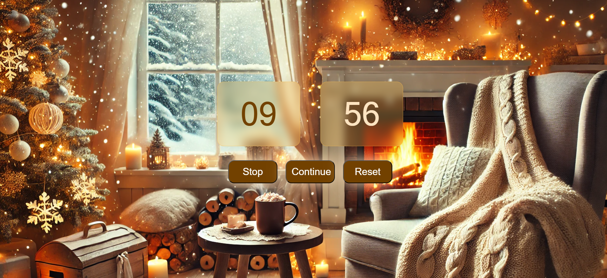

# Countdown Timer

## Proje Açıklaması

Bu proje, kullanıcıların belirli bir süre geri sayım yapmasını sağlayan basit bir web tabanlı geri sayım sayacıdır. Kullanıcılar dakika ve saniye cinsinden bir süre girebilir, geri sayımı başlatabilir, durdurabilir, devam ettirebilir ve sıfırlayabilir.

## Özellikler

-   **Geri Sayım Ayarı:** Kullanıcılar geri sayım süresini dakika ve saniye olarak ayarlayabilir.
-   **Başlat/Durdur/Devam Ettir/Sıfırla Kontrolleri:** Geri sayımı başlatmak, durdurmak, devam ettirmek ve sıfırlamak için kullanıcı dostu arayüz.
-   **Sesli Uyarı:** Geri sayım tamamlandığında sesli bir uyarı çalar.
-   **Görsel Arayüz:** Şık ve kullanıcı dostu arayüz.

## Kullanılan Teknolojiler

-   HTML
-   CSS
-   JavaScript

## Kullanım

1.  Dakika ve saniye giriş alanlarına istediğiniz geri sayım süresini girin.
2.  "Başlat" düğmesine tıklayarak geri sayımı başlatın.
3.  Geri sayımı durdurmak için "Stop" düğmesine tıklayın.
4.  Durdurulan geri sayımı devam ettirmek için "Continue" düğmesine tıklayın.
5.  Geri sayımı sıfırlamak için "Reset" düğmesine tıklayın.

## Ekran Görüntüleri

